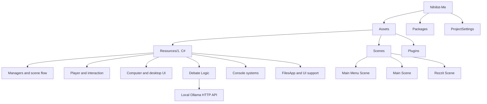

# Nihilist Me

## Project Overview

`Nihilist Me` is a Unity project built with Unity `6000.2.6f2`. Its project-owned code combines explorable gameplay, interactable objects, an in-game computer/desktop interface, debate gameplay, and smaller console-based activities.

  
  
  

| Contributor | Contributions |
|---|---|
| **Natanael Kevin Kurniawan** | Worked across most aspects of the game, including core gameplay mechanics, UI/UX, 2D and 3D art, and integration of the local LLM. |
| **Maximillian Kenas** | Contributed to bug hunting and debugging, helped resolve gameplay and technical issues, and worked on completing parts of the UI. |

  

## Features

- Main menu, main gameplay, and Rezzit scenes.
- Player movement and interaction with objects such as computers and doors.
- An in-game desktop with file-oriented UI and draggable windows.
- Debate flow with topics, conversation history, opponent turns, judging, fallacy tracking, performance metrics, win/loss counts, and optional logging.
- Local Ollama integration through a JSON HTTP request. The configured defaults are `http://127.0.0.1:11434/api/generate` and the `mistral` model.
- Console systems including a Wordle-style game, cosmetics, inventory, shop, and gacha-related components.
- Pause, audio, graphics, cursor, animation, and save/settings systems.

## Project Structure

## Important Systems / Architecture

- `GameManager` is a persistent singleton that handles pause input, references scene objects, and coordinates the pause state.
- `SceneChangeManager` loads the main menu or main scene and can reopen the desktop after a scene change.
- `GlobalManagerGroup` and `DebateDataManager` persist selected manager state across scene loads with `DontDestroyOnLoad`.
- `SaveSystem` serializes game data and settings to `save.dat` and `settings.dat` under Unity's `Application.persistentDataPath`.
- The debate subsystem separates state/data management, transport (`DebateNetwork`), parsing, scoring, visual management, and file logging.
- UI and layout components use Nova types such as `UIBlock2D`, `TextBlock`, and gesture-related components.

## Development Notes

- Open the project with Unity `6000.2.6f2`.
- The enabled build scenes are `Main Menu Scene`, `Main Scene`, and `Rezzit Scene`. `Menu Scene` is present in build settings but disabled.
- To use the debate's AI responses, run an Ollama service locally and make the configured model available, or change `DebateDataManager`'s URL/model settings.
- Package dependencies are declared in `Packages/manifest.json`, including URP `17.2.0`, Input System `1.14.2`, and Cinemachine `2.10.5`
